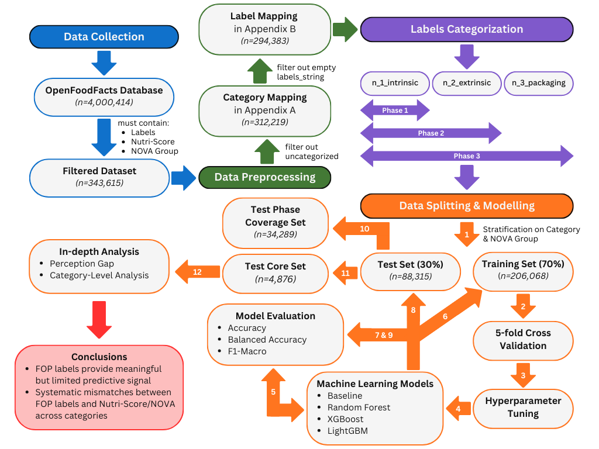

# Beyond the Label: Predicting Nutri-Score and NOVA Classifications from Packaging Cues, with Machine Learning
## Introduction
This repository contains the code for my MSc thesis, "Beyond the Label: Predicting Nutri-Score and NOVA Classifications from Packaging Cues, with Machine Learning." The study investigates whether front-of-pack (FOP) information can predict two food quality indicators: Nutri-Score and NOVA. Using a large-scale dataset from Open Food Facts, I train and evaluate tree-based models (Random Forest, XGBoost, LightGBM) across three phases that progressively add more packaging features, from intrinsic product attributes to extrinsic cues such as health claims and endorsement logos. The results show that FOP labels contain meaningful, but imperfect, signal about underlying nutritional quality and processing level, and reveal systematic mismatches that vary across product categories.

## Data Pipeline


## Repository Overview

```
├── data/                 # Local data storage (raw files, not all tracked in git)
├── gen/                  # Generated files (figures, tables, data files)
├── results/              # Final model outputs, metrics, and analysis results
├── src-modelling/        # Modeling pipeline (splits, training, evaluation, perception analysis)
├── src-preparation/      # Data retrieval, cleaning, mapping, and final dataset creation
├── .gitignore
└── README.md

```

### `src-preparation/`

- `1_retrieve_dataset.ipynb` – Download and subset Open Food Facts to the working dataset.
- `2_prepare_data.R` – Initial cleaning, filtering, and variable selection.
- `3_category_mapping.R` – Map products to harmonised product categories.
- `4_label_mapping.R` – Map FOP labels to analysis-ready formats.
- `5_create_final_dataset.R` – Build the final modeling dataset used in all phases.
- `6_explore_final_dataset.R` – Descriptive statistics and exploratory plots.

### `src-modelling/`

Numbering reflects the modeling pipeline:

- `1.x_*` – Create train/validation/test splits for Nutri-Score and NOVA.
- `2.0.x_*baseline*.ipynb` – Train simple baseline models for Nutri-Score and NOVA.
- `2.1.x_*RF*.ipynb` – Train Random Forest models.
- `2.2.x_*XGBoost*.ipynb` – Train XGBoost models.
- `2.3.x_*LightGBM*.ipynb` – Train LightGBM models.
- `3.0–3.2_*eval_*`.ipynb – Evaluate baseline and tree-based models (accuracy, balanced accuracy, F1-macro, etc.).
- `4.0–4.2_*perception_*`.ipynb – Error and mismatch analysis used to study perception biases.

## About
***by Jennicka Wijma, Tilburg, 2025***